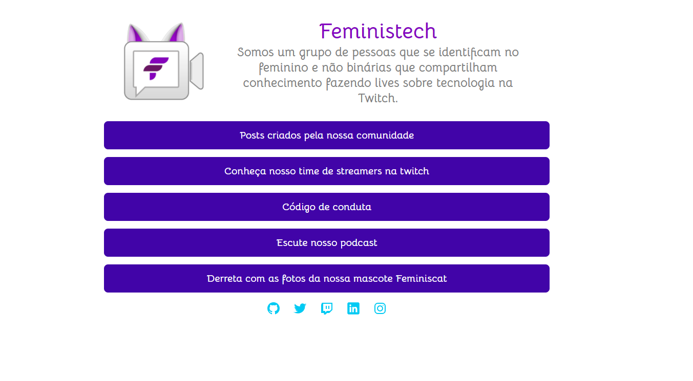
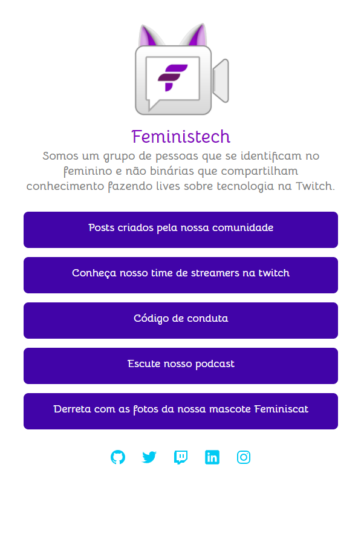

# Mentoria Feministech Projeto 01

O programa de mentoria desenvolvido pela Feministech é voltado para mulheres e pessoas não binárias em inicio de carreira e tem como intuito desenvolver as habilidades com HTML e CSS. 

---
O primeiro projeto consiste em reproduzir a página da [Feministech](https://feministech.github.io/) visando praticar HTML semântico, CSS e metodologia BEM.

## Acesse o projeto online : 
[Mentoria Feministech](https://catiuu.github.io/mentoria-feministech-proj01/)

## Habilidades Praticadas: 
### HTML
* Semântica:
  - header
  - main
  - section
  - nav
  - footer
  - h1/h2
  - listas
    - Lista de links não ordenados

### CSS
* Metodologia BEM:
  - Bloco
  - Elemento

### Responsividade
  - Design responsivo

## Screenshots do Projeto:

Desktop

Mobile

